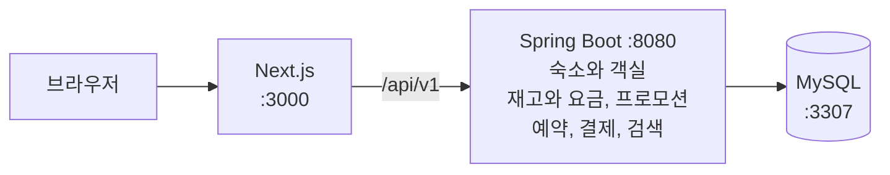
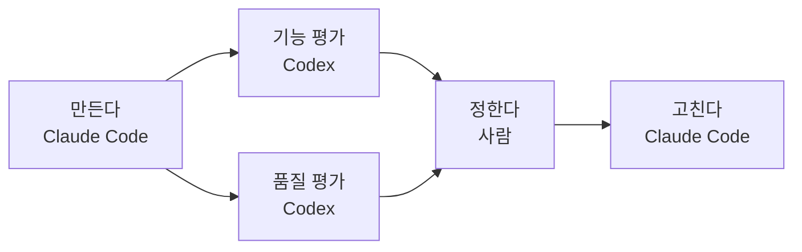

# stay-booking

호스트가 객실과 날짜별 재고를 올리고 게스트가 검색, 예약, 결제하는 숙박 예약 서비스다. 도메인 주도 설계(DDD)로 설계 문서를 쓰고 Spring Boot 백엔드와 Next.js 화면으로 구현했다. 핵심 문제는 아래 셋이다.

- [동시 예약](#동시-예약): 마지막 객실 하나에 두 명이 동시에 예약해도 한 명만 성공한다
- [같은 요청 재전송](#같은-요청-재전송): 응답을 못 받아 같은 요청을 다시 보내도 한 번만 처리한다
- [결제 승인과 만료](#결제-승인과-만료): 결제 승인과 예약 만료가 겹쳐도 결과는 하나다

## 기능

| 사용자 | 할 수 있는 일 |
|---|---|
| 누구나 | 숙소 검색, 빈 객실과 예상 금액과 할인 조회 |
| 게스트 | 예약과 조회, Mock 결제, 취소와 전액 환불 |
| 호스트 | 숙소와 객실 등록, 날짜별 재고와 요금 관리 |
| 운영자 | 자동 적용 할인(프로모션) 등록과 수정 |
| 시스템 | 결제 승인 시 확정, 시한 초과나 3회 실패 시 만료 |

범위는 로컬 개발과 검증, EC2 한 대 배포까지다. 무중단 운영과 지표 수집은 넣지 않고, 배포는 2026-09-25 기준 계획 단계라 AWS 자원은 아직 없다.

로그인 대신 개발용 요청 헤더 `X-Dev-Actor-Id`로 사용자를 정하고, 결제는 실제 대행사 대신 모의(Mock) 결제를 쓴다.

## 구조



브라우저는 Next.js만 부르고, /api/v1 아래 요청은 Next.js가 백엔드로 넘긴다. 백엔드는 Spring Boot 애플리케이션 하나이고 MySQL은 Docker 컨테이너로 띄운다.

설계에서 나눈 업무 영역(바운디드 컨텍스트)마다 패키지 하나를 둔다. 숙소와 객실(catalog), 재고와 요금(inventory), 프로모션(promotion), 예약(booking), 결제(payment), 검색(search)이고 검색은 다른 영역의 데이터를 읽기만 한다. 층 규칙은 [backend/README.md](backend/README.md)에 있다.

| 구분 | 기술 |
|---|---|
| 백엔드 | Java 21, Spring Boot 4.1, Gradle 9.7 |
| DB | MySQL 9.7 (Docker 컨테이너) |
| 프론트 | Next.js 16.3, React 19.2, TypeScript 5.9 |
| 화면과 데이터 | Tailwind CSS 4.3, TanStack Query 5 |
| 백엔드 테스트 | JUnit 6, 실제 MySQL 컨테이너 |
| 프론트 테스트 | Vitest, Testing Library, MSW, Playwright |

## 핵심 문제를 푼 방법

### 동시 예약

- 문제: 마지막 객실 하나에 두 명이 동시에 예약하면 둘 다 남은 수량 1을 읽고 둘 다 성공할 수 있다.
- 방법: 예약할 날짜의 재고 행을 날짜 순서로 잠근 뒤(비관적 락, SELECT ... FOR UPDATE) 수량을 줄인다. 늦게 온 요청은 남은 수량 0을 읽고 409 INVENTORY_UNAVAILABLE을 받는다. 연박 중 하루라도 모자라면 어느 날짜도 잡지 않는다.
- 확인: [BookingApiTest](backend/src/test/java/com/o2o/booking/api/BookingApiTest.java) K19. 두 요청을 동시에 보내 하나만 201을 받는다.

### 같은 요청 재전송

- 문제: 응답을 못 받은 클라이언트가 같은 예약 요청을 다시 보내면 예약이 두 번 생길 수 있다.
- 방법: 예약, 결제 요청, 취소는 요청마다 고유 키를 담는 Idempotency-Key 헤더를 필수로 받는다. 같은 키로 같은 내용이 다시 오면 처리하지 않고 첫 응답을 돌려주고, 다른 내용이면 409 IDEMPOTENCY_KEY_REUSED다.
- 확인: [BookingApiTest](backend/src/test/java/com/o2o/booking/api/BookingApiTest.java) K15. 같은 키로 다시 보내면 같은 응답이 오고 재고 선점 수가 늘지 않는다.

### 결제 승인과 만료

- 문제: 예약은 재고를 잡은 뒤 정해진 시한 안에 결제가 승인돼야 확정된다. 승인 처리와 만료 처리가 같은 순간에 돌면 먼저 잠근 쪽에 따라 결과가 갈릴 수 있다.
- 방법: 승인 기록의 서버 시각이 만료 시각보다 앞이면 확정하고, 같거나 뒤면 승인액을 환불하고 만료한다. 두 처리가 이 판정 하나를 같이 불러 순서와 관계없이 결과가 하나다.
- 확인: [BookingLockContentionTest](backend/src/test/java/com/o2o/booking/application/BookingLockContentionTest.java). 두 처리를 동시에 보내고 순서를 바꿔도 결과가 하나인지 본다.

## 개발 방식



평가는 만든 대화를 모르는 Codex 새 작업 둘이 따로 한다. 두 도구는 API로 이어져 있지 않고, 파일 전달과 반영 결정과 완료 확정은 사람이 한다.

스크립트가 평가 전에는 산출물 형식을, 결정 뒤에는 지적마다 결정이 있고 거부한 지적에 이유가 있는지를 검사한다. 백엔드는 기능 하나를 코드, 테스트, 검증까지 끝낸 뒤 다음 기능으로 넘어갔다.

양식, 평가 기준, 검사 스크립트, 작업 기록은 [harness/](harness/README.md)에 있다.

## 실행

준비물은 JDK 21, Docker(Compose 포함), Node.js 20.9 이상이다.

```
# 백엔드. 저장소 루트에서
cp backend/env.example backend/.env
# backend/.env에 O2O_MYSQL_ROOT_PASSWORD, O2O_MYSQL_USER, O2O_MYSQL_PASSWORD를 채운 뒤
docker compose -f backend/docker-compose.yml up -d
cd backend
JAVA_HOME=<JDK 21 경로> ./gradlew bootRun

# 프론트. 다른 터미널에서 저장소 루트부터
cd frontend
npm install
npm run dev
```

`http://localhost:3000`을 연다. 새 DB에는 예시 데이터가 없으니 화면 위 개발용 바에서 host_001을 골라 숙소, 객실 타입, 날짜별 재고와 요금을 등록한 뒤 guest_001로 바꿔 예약한다.

Mock 결제의 기본값은 승인이다. 실행이 실패할 때의 출력과 원인은 [backend/README.md](backend/README.md)의 실행 절에 있다.

## 테스트

| 대상 | 명령 | 결과 |
|---|---|---|
| 백엔드 | `./gradlew test` | 460건, 실패 0 |
| 프론트 단위 | `npm run test` | 230건 통과 |
| 프론트 검사 | `npm run typecheck`, `lint`, `build` | 오류 0 |
| E2E | `npm run test:e2e` | 6건 통과 |

마지막 측정은 2026-09-16 main [eb4cc19](https://github.com/join5201/stay-booking/commit/eb4cc19)이고, 그 뒤 소스와 테스트 코드는 바뀌지 않았다. 백엔드 테스트는 bootRun과 같은 DB의 스키마를 지우고 다시 만들어 띄워 둔 앱의 데이터도 지운다. E2E 조건은 [frontend/README.md](frontend/README.md#2-실행)에 있다.

## 더 보기

| 문서 | 내용 |
|---|---|
| [설계 요약](document/06-6-o2o-design-digest.md) | 영역 경계, 애그리거트, 책임, 계약의 요약 |
| [API 명세](document/11-o2o-api-spec.md) | 서비스 API 32개와 Mock API 1개 |
| [용어 사전](document/05-3-o2o-glossary.md) | 영역별 용어 정의 |
| [document/](document/README.md) | 설계 문서 전체와 검토 기록 |
| [backend/](backend/README.md) | 백엔드 실행, 패키지 구조, 기능별 진행 |
| [frontend/](frontend/README.md) | 화면 구성, 실행, E2E 조건 |
| [harness/](harness/README.md) | AI 개발 절차의 양식, 평가 기준, 검사 스크립트 |

## 라이선스

라이선스 파일을 두지 않았다. 만든 사람은 [join5201](https://github.com/join5201)이다.

최초 작성: 2026-09-08

최종 갱신: 2026-09-25
