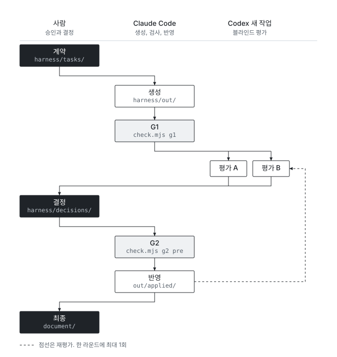
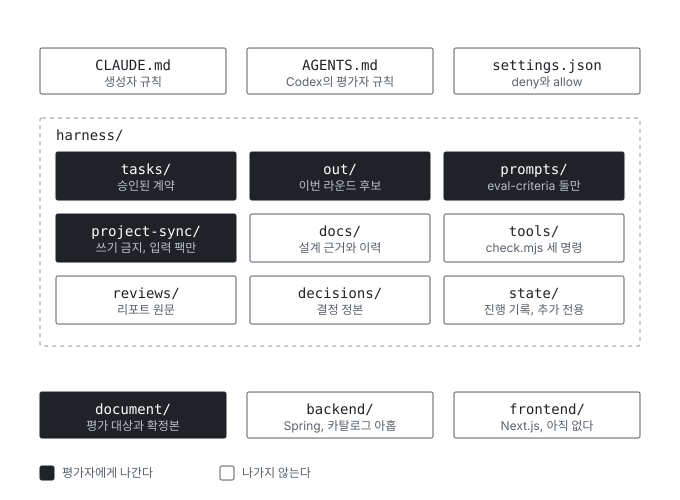

# stay-booking

O2O 숙박 예약 서비스의 DDD 설계와 그 설계를 돌리는 하네스(Harness).

최초 작성: 2026-09-08
최종 갱신: 2026-09-10 (파일 색인 신설. 문서와 그림을 링크로 잇는다)

## 빠른 찾기

경로를 외우지 않고 하려는 일로 찾는다. 이 표가 이 파일의 본체다.

| 하려는 일 | 열 파일 |
|---|---|
| 지금 어디까지 왔는지 본다 | [progress.md](harness/state/progress.md). 그 Task의 마지막 행이 현재 위치다 |
| 하네스가 어떻게 도는지 한눈에 본다 | [10-17 도해](harness/docs/10-17-o2o-harness-overview.md). 아래 그림 셋이 그 문서의 것이다 |
| 생성 세션의 규칙을 본다 | [CLAUDE.md](CLAUDE.md) |
| 평가 세션의 규칙을 본다 | [AGENTS.md](AGENTS.md) |
| 답변 형식과 등급을 본다 | [answer-format.md](harness/prompts/answer-format.md) |
| 평가자에게 무엇을 넘길지 고른다 | [evaluate.md](harness/prompts/evaluate.md)의 허용 입력 표 |
| 작업 계약을 쓴다 | [task-contract.md](harness/prompts/task-contract.md). 지난 계약은 [harness/tasks/](harness/tasks/README.md) |
| 검사를 돌린다 | [harness/tools/README.md](harness/tools/README.md) |
| 이슈와 브랜치와 커밋 순서를 본다 | [CLAUDE.md](CLAUDE.md) 4-1절 |
| worktree를 열거나 닫는다 | [10-10](harness/docs/10-10-o2o-harness-worktree-split.md) 4절과 8절 |
| 결정이 무엇이었는지 찾는다 | [harness/decisions/](harness/decisions/README.md) |
| 같은 사고가 전에 났는지 본다 | [troubleshooting.md](harness/state/troubleshooting.md) |
| 설계의 핵심만 빨리 읽는다 | [06-6 다이제스트](document/06-6-o2o-design-digest.md) |
| 용어의 뜻을 찾는다 | [05-3 컨텍스트별 용어 사전](document/05-3-o2o-glossary.md) |
| API 규격을 본다 | [11 API 명세](document/11-o2o-api-spec.md) |
| 백엔드를 띄운다 | [backend/README.md](backend/README.md) |

## 그림 셋

한 라운드의 아홉 단계

폴더 지도와 평가 입력 경계

게이트

셋의 근거와 고치는 법은 [10-17](harness/docs/10-17-o2o-harness-overview.md)에 있다. 규칙이 바뀌면 정본을 먼저 고치고 그림을 다시 그린다.

## 이 저장소가 담는 것

두 가지다. 서비스 설계 문서와, 그 문서를 만들고 검증하는 절차다.

하네스는 모델을 뺀 전부다. 파일 규약, 검사 스크립트, 기록 규칙, 프롬프트 양식이 하네스이고 LLM 호출은 사람이 두 앱에서 한다. 생성과 수정은 Claude Code, 평가는 Codex의 새 작업(A와 B 분리), 전달은 사용자다. 별도 LLM API를 호출하지 않는다.

| 항목 | 값 |
|---|---|
| 백엔드 | Spring 기반 Java, MySQL |
| 프론트 | Next.js. 아직 코드 없음 |
| 범위 | 로컬 개발과 검증까지. 배포와 운영 제외 |
| 검사 스크립트 | Node |

## 규칙 파일

| 파일 | 독자 |
|---|---|
| [CLAUDE.md](CLAUDE.md) | 생성자. Claude Code가 읽는다 |
| [AGENTS.md](AGENTS.md) | 평가자. Codex가 읽는다 |
| [.claude/settings.json](.claude/settings.json) | 권한 게이트. 비밀 파일 읽기와 삭제 명령을 막는다 |
| [.coderabbit.yaml](.coderabbit.yaml) | 리뷰 봇. 언어와 문체 규칙과 경로별 지시문. 근거는 [10-16](harness/docs/10-16-o2o-harness-coderabbit.md) |
| [backend/CLAUDE.md](backend/CLAUDE.md), [backend/AGENTS.md](backend/AGENTS.md) | 백엔드 전용 규칙 |

CLAUDE.md와 AGENTS.md 둘을 잇지 않았다. AGENTS.md의 소스 수정 금지 조항을 생성자가 따르면 생성 자체가 불가능해지기 때문이다.

## 디렉터리

세 디렉터리의 성격을 이름으로 가른다. 섞어 두면 평가에 넘길 파일을 고를 때마다 성격을 다시 판단해야 하고, 계획 문서가 평가 입력에 섞이는 사고가 난다.

| 경로 | 성격 | 평가 입력이 될 수 있나 |
|---|---|---|
| [document/](document/README.md) | O2O 서비스 베이스 설계 문서 | 된다 |
| [harness/prompts/](harness/prompts/README.md) | 실행 중 읽는 양식과 평가 기준 | 기준 파일만 |
| [harness/docs/](harness/docs/README.md) | 하네스 설계 근거와 결정 이력 | 안 된다 |

라운드마다 쌓이는 폴더는 넷이다. 파일명 규약이 각 README에 있다.

| 경로 | 무엇이 쌓이나 |
|---|---|
| [harness/tasks/](harness/tasks/README.md) | 작업 계약 |
| [harness/out/](harness/out/README.md) | 생성 후보와 형식 보정 이력 |
| [harness/reviews/](harness/reviews/README.md) | 평가 리포트 원문 |
| [harness/decisions/](harness/decisions/README.md) | 결정의 정본 |

나머지 셋이다.

| 경로 | 역할 |
|---|---|
| [harness/tools/](harness/tools/README.md) | 검사 스크립트 |
| [harness/state/](harness/state/README.md) | 진행, 트러블슈팅, 누적 지식. 전부 추가 전용 |
| harness/project-sync/ | 프로젝트 계열 원본 사본. 수정 금지. 반입 절차는 [10-15](harness/docs/10-15-o2o-harness-ondemand-rules.md) |

## 설계 문서

| 파일 | 무엇 |
|---|---|
| [01 계획](document/01-o2o-ddd-plan.md) | DDD 설계 진행 계획. Step 정의의 출처 |
| [02 기능 목록](document/02-o2o-feature-list.md) | 기능 목록 |
| [03 이벤트 스토밍](document/03-o2o-event-storming.md) | 도메인 이벤트 |
| [04 커맨드와 액터](document/04-o2o-commands-actors.md) | 책임과 협력 지도 |
| [05-1 유비쿼터스 언어](document/05-1-o2o-ubiquitous-language.md) | 컨텍스트 간 용어 충돌 |
| [05-2 바운디드 컨텍스트](document/05-2-o2o-bounded-contexts.md) | 컨텍스트 확정 |
| [05-3 용어 사전](document/05-3-o2o-glossary.md) | 컨텍스트별 용어. 용어를 찾을 자리 |
| [05 용어 사전](document/05-o2o-glossary.md) | Step 4 판. 05-3의 앞 판이다 |
| [06-1 컨텍스트 맵](document/06-1-o2o-context-map.md) | 컨텍스트 사이의 관계 |
| [06-2 애그리거트](document/06-2-o2o-aggregates.md) | 애그리거트 레퍼런스. [설명본](document/06-2-o2o-aggregates-explained.md) |
| [06-3 애그리거트 검증](document/06-3-o2o-aggregates-blind-review.md) | 06-2 초안 블라인드 리포트 |
| [06-4 계약과 정책](document/06-4-o2o-contracts.md) | DbC 레퍼런스. [설명본](document/06-4-o2o-contracts-explained.md) |
| [06-5 계약 검증](document/06-5-o2o-contracts-blind-review.md) | Step 7 블라인드 기록 |
| [06-6 다이제스트](document/06-6-o2o-design-digest.md) | 애그리거트와 CRC와 DbC 요약. 가장 빨리 읽는 자리 |
| [06 보드 범례](document/06-o2o-board-legend.md) | 이벤트 스토밍 보드 범례 |
| [11 API 명세](document/11-o2o-api-spec.md) | API 규격 |
| [12 문서 검토](document/12-o2o-document-review.md) | 검토와 수정 내역. 안의 절대경로 링크는 2026-09-07 개편 이전 것이라 끊겨 있다 |
| [서비스 형태](document/o2o-service-types.md), [공간과 숙박 형태](document/o2o-space-stay-types.md) | 유형 정리 |

## 하네스 문서

번호가 크면 나중 것이다. 결정의 정본은 harness/decisions/이고 여기 있는 것은 근거와 이력이다.

| 파일 | 무엇 |
|---|---|
| [10-4 실행 방식](harness/docs/10-4-o2o-harness-workflow-decisions.md) | 두 앱과 사람이 하는 일의 분담 |
| [10-5 인계](harness/docs/10-5-o2o-harness-handoff.md) | 작업 인계 |
| [10-6 구현 계획](harness/docs/10-6-o2o-harness-implementation-plan.md) | 적용과 구현 계획. N9 세로 진행의 근거 |
| [10-7 PDF 대조](harness/docs/10-7-o2o-harness-pdf-crosscheck.md) | PDF 8종 대조 |
| [10-8 재대조](harness/docs/10-8-o2o-harness-recheck.md) | 로컬 문서 기준 재대조 |
| [10-9 답변 형식 계획](harness/docs/10-9-o2o-harness-answer-format-plan.md) | R1부터 R4의 적용 계획 |
| [10-10 worktree 분리](harness/docs/10-10-o2o-harness-worktree-split.md) | 트리 배치와 여는 절차와 닫는 절차 |
| [10-11 보드 대조](harness/docs/10-11-o2o-board-transcription-check.md) | 09-1 전사본과 FigJam 정본 대조 |
| [10-12 결함 수정 계획](harness/docs/10-12-o2o-harness-fix-plan.md) | 하네스 결함 넷의 순서와 경계 |
| [10-13 대조 상대](harness/docs/10-13-o2o-harness-reference-crosscheck.md) | 비교 대상 다섯의 선정 근거 |
| [10-14 대조 기록](harness/docs/10-14-o2o-harness-crosscheck-promptfoo.md) | promptfoo와 superpowers와 moai-adk와 ECC |
| [10-15 내린 규칙](harness/docs/10-15-o2o-harness-ondemand-rules.md) | CLAUDE.md에서 내린 절차의 본문 |
| [10-16 CodeRabbit](harness/docs/10-16-o2o-harness-coderabbit.md) | 리뷰 봇 설정의 근거 |
| [10-17 도해](harness/docs/10-17-o2o-harness-overview.md) | 위 그림 셋의 정본 |
| [10-18 대조 종합](harness/docs/10-18-o2o-harness-crosscheck-rollup.md) | 대조 넷의 판정과 변경 전부 |

## 양식과 기준

| 파일 | 언제 여나 |
|---|---|
| [task-contract.md](harness/prompts/task-contract.md) | 계약 단계 |
| [generate.md](harness/prompts/generate.md) | 생성 단계 |
| [evaluate.md](harness/prompts/evaluate.md) | 평가 A와 B 요청. 허용 입력 표가 여기 있다 |
| [decision-table.md](harness/prompts/decision-table.md) | 결정 단계 |
| [apply.md](harness/prompts/apply.md) | 반영 단계 |
| [eval-criteria-ddd.md](harness/prompts/eval-criteria-ddd.md) | 설계 문서 평가 기준. 평가자에게 나간다 |
| [eval-criteria-code.md](harness/prompts/eval-criteria-code.md) | 코드 작업 평가 기준. 평가자에게 나간다 |
| [answer-format.md](harness/prompts/answer-format.md) | 답변 등급과 결과 절 다섯 행 |
| [07 v3](harness/prompts/07-o2o-ptcf-prompt.v3.md) | 설계용 마스터 프롬프트 |
| [harness v2](harness/prompts/harness-ptcf-prompt.v2.md) | 하네스 세션 인계용 |
| [dev v3](harness/prompts/dev-ptcf-prompt.v3.md) | 개발 세션용 |

## 지금 상태

| 항목 | 상태 |
|---|---|
| 설계 Step 1부터 7 | 완료 |
| 설계 Step 8 | task-S8 R1 반영과 결정 완료 |
| 설계 Step 9 | task-S9-catalog 완료. task-S9-inventory-rate R1 병합 |
| 하네스 H0부터 H6 | 완료. 검사기와 양식과 기록 규칙과 작업 계약이 다 있다 |
| 백엔드 | 카탈로그와 재고와 요금까지 구현. [backend/](backend/README.md) |
| 프론트 | 미착수 |

이 표는 요약이고 정본이 아니다. 현재 위치의 정본은 [progress.md](harness/state/progress.md)이고 그 Task의 마지막 행이다.

## 추적하지 않는 것

tmp/, output/, Claude outputs/, _to_delete/, .tmp_hla_check/는 [.gitignore](.gitignore)로 제외했다. 과거 산출물, PDF, 생성 이미지, 중복 사본이다. 파일 자체는 로컬에 그대로 있다. 치우는 파일은 지우지 않고 tmp/_moved/로 옮긴다.

## 이 색인을 믿어도 되는 이유

링크가 끊기면 검사가 잡는다.

    node harness/tools/check.mjs g1 README.md --type doc

link.exists가 이 파일의 모든 상대경로 링크를 연다. 파일이 옮겨지거나 이름이 바뀌면 실패한다.

2026-09-10 현재 이 명령이 doc.end-sentence 한 건으로 FAIL을 낸다. 루트 문서가 검사기의 성격 표에 없어서 Step 산출물의 종료 문장 규칙이 잘못 적용된다. 링크 검사 자체는 통과한다. 이슈 74가 이것을 잡고 있고 고치는 PR이 이미 올라와 있다.

검사가 못 잡는 것도 있다. 설명 한 줄이 낡는 것은 못 잡는다. 각 디렉터리의 README.md가 무엇이 그 폴더에 들어가는지의 정본이고, 이 파일은 어디 있는지만 답한다.
