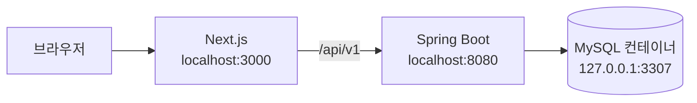
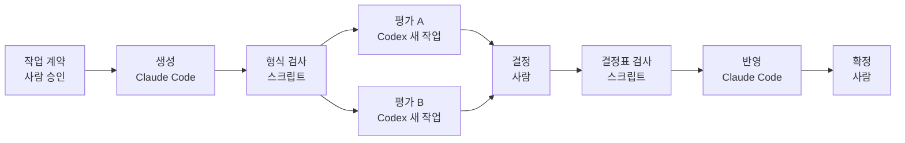

# stay-booking

최초 작성: 2026-09-08
최종 갱신: 2026-09-23 (저장소 소개 본문을 새로 썼다. 이슈 195)

O2O 숙박 예약 서비스의 설계 문서와 구현을 담은 저장소다. 호스트가 숙소와 객실, 날짜별 재고와 요금을 올리고, 게스트가 숙소를 검색해 예약하고 결제하며, 운영자가 프로모션을 만든다. 도메인 주도 설계(DDD)로 설계 문서를 쓰고 Spring Boot 백엔드와 Next.js 화면으로 구현했으며, 로컬 개발과 검증까지 다룬다.

## 기능

| 역할 | 할 수 있는 일 | 명세 |
|---|---|---|
| 공개 | 숙소와 객실 조회, 숙소 검색, 객실 가용성과 예상 금액 조회, 적용 가능한 프로모션 조회 | [숙소](document/11-o2o-api-spec.md#숙소), [객실 타입](document/11-o2o-api-spec.md#객실-타입), [검색](document/11-o2o-api-spec.md#검색), [프로모션](document/11-o2o-api-spec.md#프로모션) |
| 호스트 | 본인 숙소와 객실 타입의 등록과 수정, 날짜별 재고와 요금 관리 | [숙소](document/11-o2o-api-spec.md#숙소), [객실 타입](document/11-o2o-api-spec.md#객실-타입), [재고](document/11-o2o-api-spec.md#재고), [요금](document/11-o2o-api-spec.md#요금) |
| 운영자 | 프로모션 등록, 수정, 관리 목록 조회 | [프로모션](document/11-o2o-api-spec.md#프로모션) |
| 게스트 | 본인 예약의 요청과 조회, Mock 결제 요청, 확정 예약 취소와 전액 Mock 환불 | [예약과 결제](document/11-o2o-api-spec.md#예약과-결제) |
| 시스템 | Mock 결제 결과 전달, 결제 승인 시 예약 확정, 선점 시한이 지나거나 결제가 세 번 실패한 예약의 만료, 만료 뒤 도착한 승인의 환불 | [내부 처리와 Mock 이벤트](document/11-o2o-api-spec.md#내부-처리와-mock-이벤트) |

## 범위

| 항목 | 들어 있는 것 | 없는 것 |
|---|---|---|
| 실행 환경 | 로컬 개발과 검증 | 배포와 운영 준비 |
| 인증 | 개발 프로파일에서 요청 헤더 `X-Dev-Actor-Id`로 역할과 소유자를 정한다 | 회원가입, 로그인, 토큰 |
| 결제 | Mock 결제 요청, Mock 결과 전달, Mock 환불 | 실제 결제 대행 연동 |
| 서비스 형태 | 날짜별 객실 재고를 선점하는 숙박 예약 | 배차, 배달, 채팅, 정산, 광고 |
| 검증 | 백엔드, 화면, E2E 자동 테스트 | 부하 측정 |

현재 상태(2026-09-23 기준): 명세의 서비스 API 32개와 로컬 Mock API 1개, 화면 열네 개(게스트 일곱, 호스트 다섯, 운영자 둘)가 main에 있다. 백엔드의 기능별 진행 표는 [backend/README.md](backend/README.md)에 있다.

## 기술 스택

| 구분 | 기술 | 판 |
|---|---|---|
| 백엔드 | Java | 21 |
| 백엔드 | Spring Boot (Web MVC, Data JPA, Validation) | 4.1.1 |
| 백엔드 | Gradle (저장소에 래퍼 포함) | 9.7.1 |
| DB | MySQL (Docker 컨테이너) | 9.7.2 |
| 프론트 | Next.js (App Router), React | 16.3.5, 19.2.8 |
| 프론트 | TypeScript | 5.9.3 |
| 프론트 | Tailwind CSS, TanStack Query | 4.3.3, 5.102.8 |
| 테스트 | JUnit (Spring Boot 테스트 스타터) | 6.0.3 |
| 테스트 | Vitest, Testing Library, MSW | 5.0.1, 16.3.3, 2.15.0 |
| 테스트 | Playwright (Chromium) | 1.63.0 |

판은 [build.gradle](backend/build.gradle), [gradle-wrapper.properties](backend/gradle/wrapper/gradle-wrapper.properties), [docker-compose.yml](backend/docker-compose.yml), [package-lock.json](frontend/package-lock.json)에 고정된 값이다. JUnit은 build.gradle에 판을 적지 않아 Spring Boot의 의존성 관리가 정한다.

## 구성도



브라우저는 Next.js만 부른다. /api/v1 아래 요청은 Next.js가 BACKEND_URL(비어 있으면 `http://localhost:8080`)로 넘긴다([next.config.ts](frontend/next.config.ts)의 rewrites). 백엔드에 CORS 설정이 없어 같은 출처로 부르는 구성이다. 3000과 8080은 Next.js와 Spring Boot의 기본 포트이고, 3307은 [docker-compose.yml](backend/docker-compose.yml)이 컨테이너의 3306을 이어 둔 포트다.

백엔드는 Spring Boot 모듈 하나다. com.o2o 아래에 설계의 바운디드 컨텍스트 다섯이 패키지 하나씩이고, 검색 읽기 모델과 공유 커널이 따로 패키지를 갖는다.

| 패키지 | 설계에서의 이름 | 맡는 일 |
|---|---|---|
| catalog | 숙소 카탈로그 | 호스트가 판매할 숙소와 객실 타입 |
| inventory | 재고와 요금 | 날짜별 판매 가능 수량과 단가 |
| promotion | 프로모션 | 자동 적용 할인 정책 |
| booking | 예약 | 예약 생성(재고 선점 포함), 확정, 취소, 만료 |
| payment | 결제 | 결제 요청과 결과 기록(Mock 결제) |
| search | 검색(읽기 모델) | 다른 컨텍스트의 저장소를 읽기만 해서 검색과 조회에 답한다. 층은 api와 application 둘 |
| shared | 공유 커널 | 여러 컨텍스트가 같이 쓰는 행위자 식별, 오류 응답, ID와 금액과 날짜 같은 값 |

컨텍스트 하나 안의 층은 넷이다. api가 application을, application이 domain을 부르고, infrastructure는 domain이 선언한 인터페이스를 구현한다. domain은 다른 층을 참조하지 않는다.

| 층 | 하는 일 |
|---|---|
| api | HTTP 요청을 도메인의 말로 바꾸고 형식을 검사한다 |
| application | 트랜잭션 경계, 컨텍스트를 넘는 선행조건, 이벤트 발행 |
| domain | 불변식을 지킨다. 상태를 바꾸는 유일한 입구다 |
| infrastructure | 저장, 조회, 잠금. 유일성과 무결성 |

## 설계에서 다룬 문제

| 문제 | 푼 방법 | 확인 |
|---|---|---|
| 마지막 객실 하나에 두 손님이 동시에 예약한다 | 예약 요청은 숙박 날짜의 재고 행을 날짜 오름차순으로 잠근 뒤(비관적 락, SELECT ... FOR UPDATE) 남은 수량을 보고 선점한다. 나중 요청은 앞 요청이 커밋한 뒤 남은 수량 0을 읽고 409 INVENTORY_UNAVAILABLE을 받는다. 연박 중 하루라도 모자라면 어느 날짜도 선점하지 않는다 | 명세 [T08](document/11-o2o-api-spec.md#t08), [T09](document/11-o2o-api-spec.md#t09). [BookingApiTest](backend/src/test/java/com/o2o/booking/api/BookingApiTest.java), [BookingApplicationServiceTest](backend/src/test/java/com/o2o/booking/application/BookingApplicationServiceTest.java) |
| 응답을 못 받은 클라이언트가 같은 요청을 다시 보낸다 | 예약 생성, 결제 요청, 취소는 Idempotency-Key 헤더가 필수다. 서버는 행위자, HTTP 메서드, 경로, 키를 유니크 키로 기록한다. 같은 body면 첫 응답에 Idempotency-Replayed: true를 붙여 돌려주고, 다른 body면 409 IDEMPOTENCY_KEY_REUSED, 첫 요청이 처리 중이면 409 REQUEST_IN_PROGRESS다 | 명세 [T10](document/11-o2o-api-spec.md#t10), [T11](document/11-o2o-api-spec.md#t11), [T14](document/11-o2o-api-spec.md#t14). [BookingApiTest](backend/src/test/java/com/o2o/booking/api/BookingApiTest.java), [BookingPaymentApiTest](backend/src/test/java/com/o2o/booking/api/BookingPaymentApiTest.java) |
| 결제 승인과 선점 시한 만료가 겹친다 | 확정과 만료를 승인 기록의 서버 시각 하나로 가른다. 그 시각이 만료 시각보다 앞이면 확정하고, 같거나 뒤면 승인액을 환불하고 만료한다. 승인 처리와 만료 처리가 같은 판정 메서드를 불러 처리 순서와 관계없이 결과가 하나다 | 명세 [T18](document/11-o2o-api-spec.md#t18), [T19](document/11-o2o-api-spec.md#t19), [T20](document/11-o2o-api-spec.md#t20). [BookingLockContentionTest](backend/src/test/java/com/o2o/booking/application/BookingLockContentionTest.java), [PaymentOutcomeServiceTest](backend/src/test/java/com/o2o/booking/application/PaymentOutcomeServiceTest.java) |

세 경우의 테스트는 MySQL 컨테이너에서 돈다. 명세가 동시성과 유니크 제약과 롤백을 실제 MySQL에서 확인하도록 정한다.

## 실행

| 준비물 | 조건 | 쓰는 곳 |
|---|---|---|
| JDK | 21 | 백엔드. Gradle은 래퍼(gradlew)가 받는다 |
| Docker | Compose 포함 | MySQL 컨테이너 |
| Node.js | 20.9 이상 | 프론트. Next.js 16.3 문서의 최소 판 |

```
# 백엔드. 저장소 루트에서
cp backend/env.example backend/.env
# backend/.env에 O2O_MYSQL_ROOT_PASSWORD, O2O_MYSQL_USER, O2O_MYSQL_PASSWORD를 채운 뒤
docker compose -f backend/docker-compose.yml up -d
cd backend
JAVA_HOME=<JDK 21 경로> ./gradlew bootRun

# 프론트. 다른 터미널에서 저장소 루트부터
cd frontend
npm install
npm run dev
```

`http://localhost:3000`을 열고 화면 위 개발용 바에서 행위자를 고른다. 값은 public(헤더 없음), guest_001, guest_002, host_001, host_002, operator_001이다. public이 아니면 Mock 결제 칸도 보인다. APPROVE는 승인, DECLINE은 실패 결과를 자동으로 전달하고 DEFER는 결과를 따로 보낼 때까지 기다린다. API를 직접 부를 때는 요청 헤더 `X-Dev-Actor-Id`에 행위자 ID를 넣고, Mock 결제 결과를 손으로 보낼 때는 mock_001을 쓴다.

백엔드 주소가 `http://localhost:8080`이 아니면 frontend/env.example을 frontend/.env.local로 복사하고 BACKEND_URL을 적는다. 실패했을 때의 출력과 원인은 [backend/README.md 3절](backend/README.md#3-실행)에 있다.

## 테스트

마지막 측정은 2026-09-16 main [eb4cc19](https://github.com/join5201/stay-booking/commit/eb4cc19)이다. 그 뒤 2026-09-23까지 backend와 frontend 코드는 바뀌지 않았다.

| 대상 | 폴더 | 명령 | 마지막 결과 |
|---|---|---|---|
| 백엔드 | backend | `./gradlew test` | 460건, 실패 0 |
| 프론트 단위와 컴포넌트 | frontend | `npm run test` | 230건 통과 |
| 프론트 타입, 린트, 빌드 | frontend | `npm run typecheck`, `npm run lint`, `npm run build` | 오류 0, 빌드 라우트 17 |
| E2E | frontend | `npm run test:e2e` | 6건 통과(E2E용 DB를 비운 뒤) |

백엔드 테스트는 bootRun과 같은 DB를 쓰고 스키마를 지우고 다시 만든다(create-drop). 띄워 둔 앱의 데이터도 함께 지워진다. E2E는 백엔드와 프론트를 E2E용 DB와 설정으로 띄운 뒤 돈다. 조건은 [frontend/README.md 2절](frontend/README.md#2-실행)에 있다. API 명세의 [검증 기준](document/11-o2o-api-spec.md#검증-기준) T01부터 T30은 [backend/README.md](backend/README.md) 6절에 30개 모두 통과로 기록되어 있다.

## 개발 방식

작업은 작업 계약 단위로 나누고 한 계약을 아래 절차로 진행한다. 생성과 수정은 Claude Code가 하고, 평가는 생성 대화를 모르는 Codex 새 작업 둘이 허용된 입력만 받아 따로 한다. A는 그 작업의 기능과 계약을, B는 공통 품질을 본다. 두 앱은 API로 이어져 있지 않고, 앱 사이의 파일 전달과 결정과 확정은 사람이 한다. 백엔드는 기능 하나를 코드, 테스트, 검증까지 끝낸 뒤 다음 기능으로 넘어갔다.



양식, 평가 기준, 검사 스크립트, 작업 기록과 그 근거 문서는 [harness/](harness/README.md)에 있다.

## 문서

| 문서 | 무엇 |
|---|---|
| [설계 요약](document/06-6-o2o-design-digest.md) | 설계 전체의 요약. 컨텍스트 경계, 애그리거트, 책임 분담(CRC), 계약(DbC) |
| [API 명세](document/11-o2o-api-spec.md) | 서비스 API 32개와 로컬 Mock API 1개의 경로, 요청과 응답, 오류 코드, 처리 규칙 |
| [용어 사전](document/05-3-o2o-glossary.md) | 컨텍스트별 용어 정의 |
| [컨텍스트 맵](document/06-1-o2o-context-map.md) | 컨텍스트 사이의 관계 |
| [애그리거트](document/06-2-o2o-aggregates.md) | 애그리거트 일곱과 각각이 지키는 불변식. 근거는 [설명본](document/06-2-o2o-aggregates-explained.md) |
| [계약과 정책](document/06-4-o2o-contracts.md) | 도메인 규칙과 커맨드 계약(DbC), 정책. 근거는 [설명본](document/06-4-o2o-contracts-explained.md) |
| [설계 문서 전체 목록](harness/README.md#설계-문서) | 계획, 기능 목록, 이벤트 스토밍부터 검토 기록까지 |

## 폴더

| 폴더 | 무엇 |
|---|---|
| [document/](document/README.md) | 설계 문서, API 명세, 검토 기록 |
| [backend/](backend/README.md) | Spring Boot 백엔드와 테스트, 테스트용 MySQL 컨테이너 설정 |
| [frontend/](frontend/README.md) | Next.js 화면과 테스트 |
| [harness/](harness/README.md) | AI 개발 절차의 양식, 평가 기준, 검사 스크립트, 작업 기록과 그 근거 문서 |
| [.claude/](.claude) | Claude Code 권한 규칙과 훅 설정, 절차 스킬 넷 |
| [.github/](.github) | 이슈 양식 셋과 PR 양식 |
