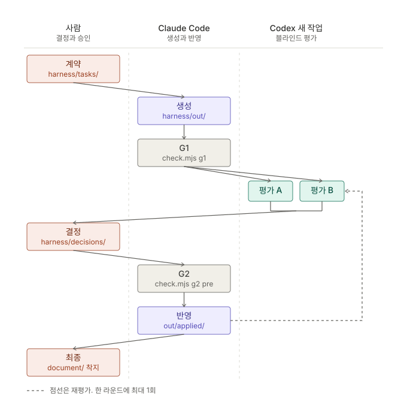
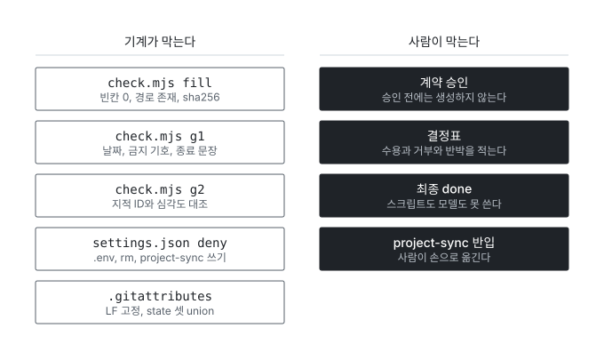

# O2O 하네스 도해

최초 작성: 2026-09-10
최종 갱신: 2026-09-10 (신설)

왜 이 문서가 필요한가: 하네스는 폴더 규약과 검사 스크립트와 기록 규칙과 프롬프트 양식 넷이 겹친 물건인데, 각 문서가 자기 몫만 적는다. 전체 모양을 보려면 README 아홉 개를 순서대로 펴야 했다. 이 문서가 그 아홉을 세 장으로 접는다.

성격: 도해다. 새 결정을 담지 않는다. 각 절의 그림은 그 절이 가리키는 정본 파일을 옮겨 그린 것이고, 둘이 어긋나면 정본이 이긴다.

정본 위치

| 그림 | 정본 |
|---|---|
| 아홉 단계 | [10-4-o2o-harness-workflow-decisions.md](10-4-o2o-harness-workflow-decisions.md) 2절, [../state/progress.md](../state/progress.md)의 단계 칸 |
| 폴더 지도 | [../../CLAUDE.md](../../CLAUDE.md) 3절, [../README.md](../README.md) |
| 평가 입력 경계 | [../prompts/evaluate.md](../prompts/evaluate.md)의 허용 입력 표 |
| 게이트 | [../tools/README.md](../tools/README.md), [../../.claude/settings.json](../../.claude/settings.json) |

## 1. 한 라운드의 아홉 단계

세 레인은 서로 API로 이어져 있지 않다. 레인을 넘는 화살표는 전부 사람이 파일을 손으로 옮기는 지점이다. 앱 간 자동 호출을 하지 않는 것이 [../../CLAUDE.md](../../CLAUDE.md) N1이고 그 이유는 10-4 1절의 비용 조건이다.

| 단계 | 누가 | 산출물이 놓이는 자리 |
|---|---|---|
| 계약 | 사람이 승인한다 | harness/tasks/task-S{Step}.md |
| 생성 | Claude Code | harness/out/task-S{Step}-R{라운드}/ |
| G1 | 검사 스크립트 | 쓰지 않는다. 읽기만 한다 |
| 평가 A | Codex 새 작업 하나 | harness/reviews/task-S{Step}-R{라운드}-A.md |
| 평가 B | Codex 새 작업 둘 | harness/reviews/task-S{Step}-R{라운드}-B.md |
| 결정 | 사람 | harness/decisions/task-S{Step}-R{라운드}.md |
| G2 | 검사 스크립트 | 쓰지 않는다. 읽기만 한다 |
| 반영 | Claude Code | harness/out/task-S{Step}-R{라운드}/applied/ |
| 최종 | 사람이 확정한다 | 확정본을 document/로 옮긴다 |

용어를 쉬운 말로 먼저 푼다. G1은 만든 문서가 양식을 지켰는지 보는 형식 검사다. 날짜 두 줄이 있는가, 금지 기호가 섞였는가, 링크가 살아 있는가를 본다. G2는 평가자가 적은 지적과 사람이 적은 결정이 한 줄도 빠지거나 뒤바뀌지 않았는지 대조하는 검사다. 지적 ID의 집합과 심각도가 두 문서에서 같아야 통과한다.

평가를 A와 B 둘로 나눈 이유는 확증이다. 다른 새 작업 둘이 같은 자리를 서로 다른 축으로 짚으면 그 중복이 근거가 된다. task-S8 R1에서 지적 17건이 조치 14건으로 닫힌 것이 그 경우다. 한 파일에 합치지 않는 규칙은 [../reviews/README.md](../reviews/README.md)에 있다.

점선은 재평가다. 한 라운드에 최대 1회이고, 재평가 횟수를 다 썼다는 사실을 완료 근거로 쓰지 않는다(10-4 2절).

## 2. 폴더 지도와 평가 입력 경계

검은 바탕과 흰 바탕을 가르는 선이 블라인드 평가의 경계다. 흰 바탕 다섯에는 왜 그렇게 만들었는지가 적혀 있어서, 평가자가 읽으면 답안지를 먼저 보는 셈이 된다.

| 폴더 | 무엇 | 평가자에게 나가나 |
|---|---|---|
| tasks/ | 작업 계약 | 승인된 계약만 나간다 |
| out/ | 생성 후보와 형식 보정 이력 | 그 라운드의 평가 대상 후보만 나간다 |
| prompts/ | 양식 5종과 기준 2종과 마스터 프롬프트 | eval-criteria 둘만 나간다 |
| project-sync/ | 프로젝트 계열 원본 사본 | 입력 팩만 나간다. 쓰기는 금지다 |
| docs/ | 하네스 설계 근거와 결정 이력 | 나가지 않는다 |
| tools/ | 검사 스크립트 | 나가지 않는다 |
| reviews/ | 평가 리포트 원문 | 나가지 않는다 |
| decisions/ | 결정의 정본 | 나가지 않는다 |
| state/ | 진행과 트러블슈팅과 누적 지식 | 나가지 않는다 |

이 표의 근거는 [../prompts/evaluate.md](../prompts/evaluate.md)의 허용 입력 표와 [../../AGENTS.md](../../AGENTS.md) E6이다. 평가자는 계약의 허용 입력에 없는 파일을 읽지 않는다.

2026-09-10 정정: [../README.md](../README.md)의 구성 표가 tasks/를 안 된다로 적고 있었다. 채운 계약이 평가 입력이라는 것은 [../prompts/README.md](../prompts/README.md)와 evaluate.md 허용 입력 표와 harness/out/task-S8-R1/eval-input/의 실제 파일 목록 셋이 같이 말하고 있었다. 셋이 같고 하나가 달라서 하나를 고쳤다. 같은 파일의 한 줄 규칙도 계약과 입력 팩이 빠져 있어 같이 고쳤다.

01 전체를 평가 입력에 넣지 않는 것은 별도 조항이다([../../CLAUDE.md](../../CLAUDE.md) N3). 입력 팩만 넘긴다. 01을 통째로 주면 블라인드 평가가 무력화된다.

## 3. 게이트

하네스가 규칙 문서가 아니라 장치인 이유가 이 그림이다. 공식 문서는 CLAUDE.md를 강제되지 않는 맥락이라고 적는다. 강제가 필요한 것은 왼쪽 다섯으로 내렸다.

| 게이트 | 종류 | 무엇을 막나 |
|---|---|---|
| check.mjs fill | 기계 | 빈칸이 남은 양식, 없는 경로, 사람이 손으로 적은 버전 |
| check.mjs g1 | 기계 | 날짜 줄 누락, 금지 기호, 죽은 링크, 종료 문장 이탈 |
| check.mjs g2 | 기계 | 지적 ID 누락, 심각도 뒤바뀜, 빈 결정, 이유 없는 거부 |
| settings.json deny | 기계 | 비밀 파일 읽기와 쓰기, 삭제 명령, project-sync 편집 |
| .gitattributes | 기계 | 줄바꿈이 바뀌어 해시가 어긋나는 것, 기록 파일 충돌 |
| 계약 승인 | 사람 | 계약 없이 생성으로 넘어가는 것 |
| 결정표 | 사람 | 평가 지적을 모델이 알아서 처리하는 것 |
| 최종 done | 사람 | 스크립트나 모델이 완료를 선언하는 것 |
| project-sync 반입 | 사람 | 원본 사본이 모델 손에 오염되는 것 |

기계 다섯과 사람 넷의 성격이 다르다. 기계는 어긴 것을 잡아내고, 사람은 넘어가는 것을 멈춘다. project-sync 반입이 사람인 이유는 [../../CLAUDE.md](../../CLAUDE.md) 3-1에 있다. 모델이 후보를 harness/out/import/에 만들고 사람이 옮긴다. 그 한 번의 손이 게이트다.

## 4. 그림 파일을 고칠 때

세 SVG는 스스로 완결된 파일이다. 색과 글꼴과 좌표가 파일 안에 다 들어 있어서 다른 스타일시트가 없어도 그대로 열린다. 대신 아래 다섯을 지킨다.

| 항목 | 규칙 |
|---|---|
| 색 | 먹색 하나와 회색 두 단계만 쓴다. 검은 바탕에 흰 글자는 두 가지에만 쓴다. 사람이 멈추는 자리와 평가자에게 나가는 것 |
| 선 | 가로와 세로만 쓴다. 대각선을 쓰지 않고 꺾을 때는 직각으로 꺾는다 |
| 선의 겹침 | 가로 구간마다 y를 다르게 둔다. 그러면 두 선이 같은 자리에 눕지 않고 세로 구간과도 만나지 않는다. 지금 그림 1의 가로 구간 일곱은 y가 전부 다르다 |
| 상자 폭 | 한글은 14px에서 글자당 약 15px, 12px에서 약 13px로 잡는다. 경로는 고정폭 글꼴이라 12px에서 글자당 약 7px다. 부제가 상자 안쪽 폭을 넘으면 부제를 줄인다 |
| viewBox | 맨 아래 요소의 바닥에 여백을 더한 값으로 높이를 맞춘다. 상자를 늘리면 높이도 같이 늘린다 |

그림과 본문이 어긋나면 본문의 표가 이긴다. 그림은 표를 옮겨 그린 것이다.

## 5. 이 문서가 담지 않는 것

| 담지 않는 것 | 어디 있나 |
|---|---|
| 결정 | [../decisions/README.md](../decisions/README.md)가 가리키는 파일들 |
| 단계별 진행 상태 | [../state/progress.md](../state/progress.md) |
| 왜 그 결정이 나왔는지의 이력 | 10-4부터 10-13 |
| 서비스 설계 | document/ |

이 문서는 도해이고 정본이 아니다. 규칙이 바뀌면 정본을 먼저 고치고 그림을 다시 그린다.
