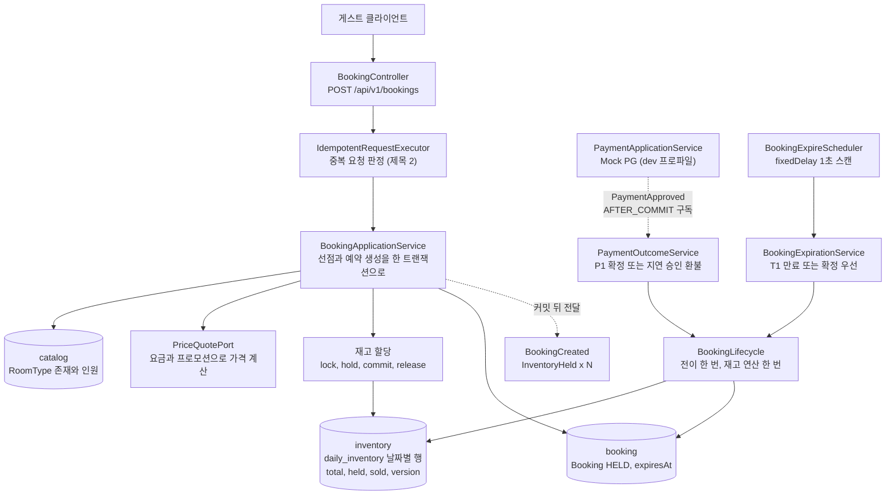
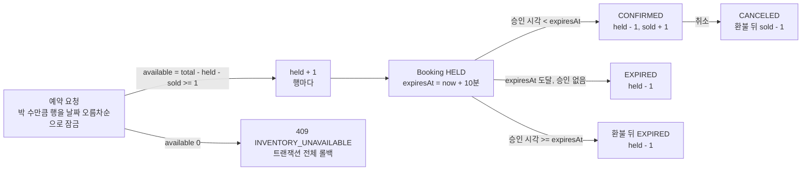
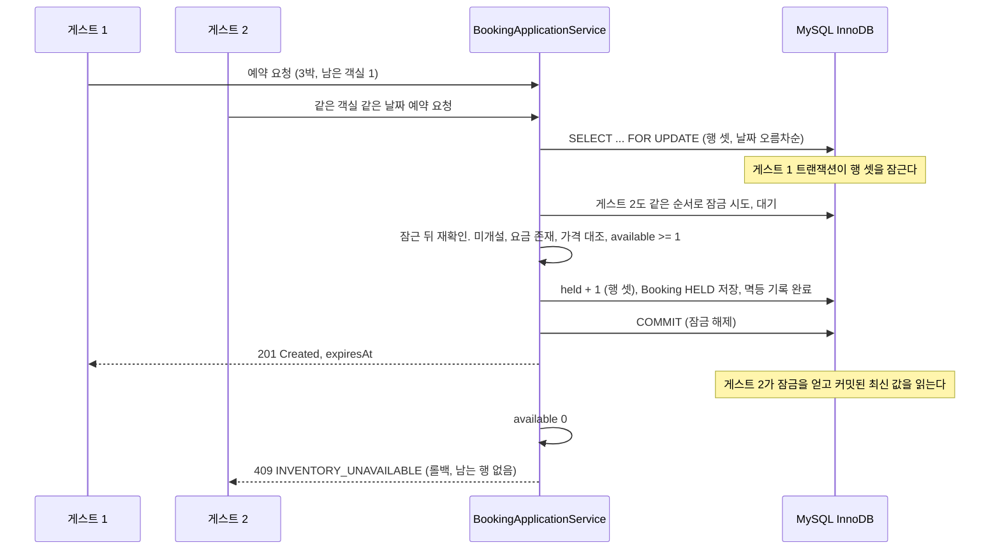
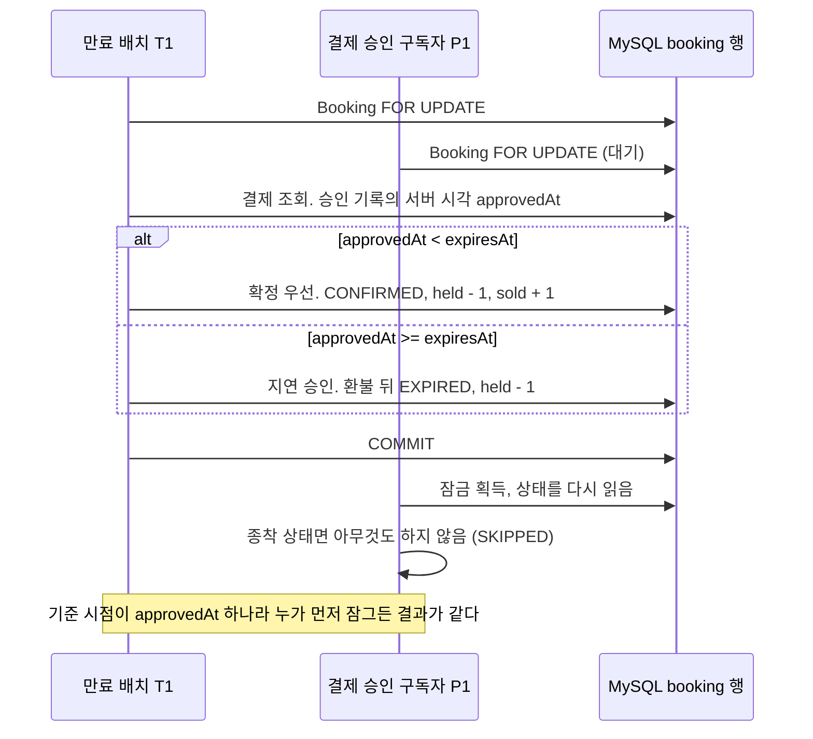
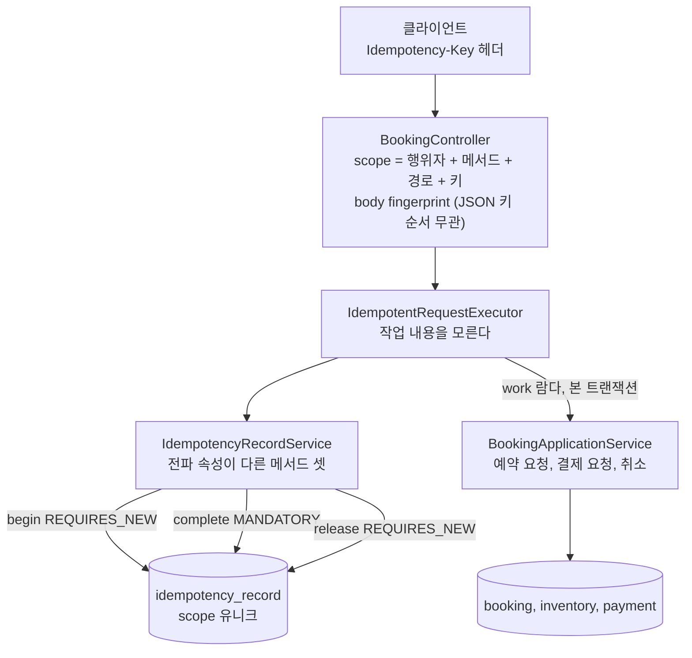
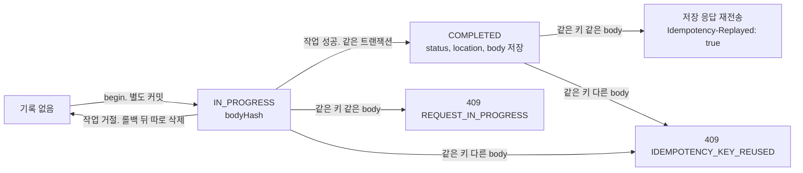
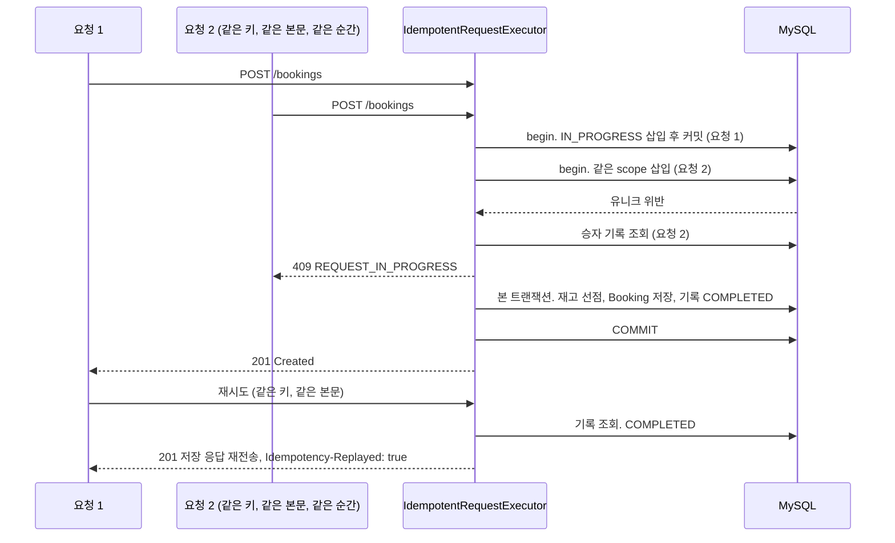
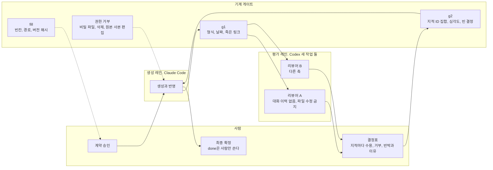
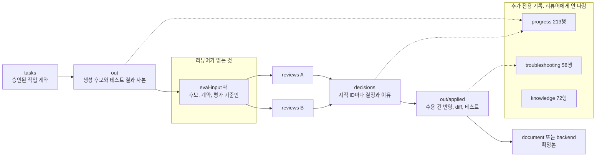
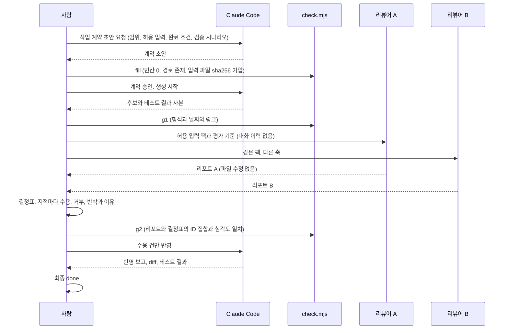

# 박세민 백엔드 포트폴리오

최초 작성: 2026-09-16
최종 갱신: 2026-09-16 (초안 1. 제목 셋과 도식 열. 기간 2026.08.26부터 확정. 학교 이름과 수치 칸은 [채울 것])

백엔드 신입. [채울 것: 학교 이름] 컴퓨터공학과 2022.03 ~ 2026.02. 이 문서는 이력서의 문제 해결 줄 셋을 도식과 상세로 편 것이다. 기능 목록은 이력서와 저장소 README에 있다.

| 팩트 | 근거 |
|---|---|
| 숙박 예약 서비스를 이벤트 스토밍부터 애그리거트와 계약 설계를 거쳐 REST API 33개와 검증 시나리오 30개까지 혼자 구현했다 | https://github.com/join5201/stay-booking |
| AI 코드 생성에 계획 승인 게이트와 독립 리뷰어 둘을 두는 워크플로우를 만들어 블라인드 리뷰 5회에서 치명 지적 7건을 배포 전에 걸렀다 | https://github.com/join5201/stay-booking/blob/main/harness/docs/10-17-o2o-harness-overview.md |
| 구독형 학습 서비스에서 유료 구독권이 결제 성공 뒤에만 켜지는 규칙을 애그리거트 경계 하나로 통제했다 (4인 팀) | https://github.com/LXP-JDG/Lxp-backend |

## 1. 예약 선점의 동시성

이력서 줄: 같은 날짜 객실에 예약이 몰리면 초과 판매나 교착이 나는 문제를 날짜별 재고 행의 비관적 잠금과 전역 잠금 순서로 막고, 실제 MySQL의 두 트랜잭션 경합 테스트로 고정했다. [채울 것: k6 동시 N명 선점에서 초과 판매 0건, 교착 0건, p95 응답 시간]

상황. 호스트는 객실 타입마다 날짜별 재고를 연다. 게스트가 3박을 예약하면 재고 행 셋이 한 번에 줄어야 한다. 같은 날짜에 예약이 몰리면 위험이 둘이다. 남은 수량보다 많이 파는 초과 판매, 그리고 두 요청이 서로 상대가 잡은 행을 기다리며 영원히 멈추는 교착이다. 예약은 10분 안에 결제되지 않으면 만료되어 재고를 돌려주므로, 결제 승인과 만료가 같은 순간 겹치는 세 번째 위험이 따라온다.

### 1-1. 아키텍처

### 1-2. 데이터 플로우

재고 행 하나의 숫자 셋과 예약 상태가 함께 움직인다. 남은 수량은 total에서 held와 sold를 뺀 값이고, 잠근 뒤에만 읽는다.

### 1-3. 시퀀스

마지막 객실 하나를 두고 게스트 둘이 같은 순간 요청한 경우다.

결제 승인과 만료가 같은 예약을 두고 같은 순간 도착한 경우다. 순서는 InnoDB가 정한다.

### 1-4. 문제 해결 상세

| 순서 | 내용 |
|---|---|
| 1 잠글 대상과 순서 | 재고는 날짜별 행이라 3박이면 행 셋을 한 번에 잠근다. 모든 경로가 예약, 결제, 재고(날짜 오름차순) 순서로만 잠그도록 정해 교착을 코드 검토가 아니라 구조로 막았다. 전용 자원을 먼저 판정하고 공유 자원인 재고를 마지막에 잡아 잠금 보유 시간을 줄인다 |
| 2 잠근 뒤 다시 읽기 | 잠금이 가격 대조보다 앞이다. 재고 행 읽기가 곧 미개설 검사라 잠근 채 두 번 읽지 않는다. 거절은 전부 예외라 트랜잭션이 통째로 되돌아가고 재고도 예약도 남지 않는다 |
| 3 경합의 답을 하나로 | 결제 승인과 만료가 겹치면 전에는 순서에 따라 확정과 환불로 갈렸다. 기준 시점을 승인 기록의 서버 시각 하나로 통일해 누가 먼저 잠그든 답이 같게 했고, 두 트랜잭션이 같은 예약 행을 두고 경합하는 통합 테스트를 양 순서로 4건 두어 실제 MySQL에서 고정했다 |

선택과 한계다. 정답이 아니라 이 환경에서 고른 이유다.

| 선택 | 이유 | 한계 |
|---|---|---|
| 재고는 비관적 잠금, 숙소 정보는 낙관적 잠금 | 재고는 경합이 곧 매출 오류라 잠그고 판정한다. 숙소 정보는 호스트 한둘이 고치는 자리라 version 대조와 409로 충분하다 | 잠근 채 Mock 결제를 부르는 자리는 실제 PG로 바꾸면 보유 시간이 외부 응답에 묶인다. 되돌림 목록(취소 환불 비동기화, 타임아웃 스케줄러)을 결정 기록에 적어 두었다 |
| 결제 트랜잭션은 READ COMMITTED | MySQL 기본 REPEATABLE READ에서는 루트만 잠그는 조회가 조인한 표를 잠금 전 스냅샷으로 읽어, 같은 결제 이벤트 둘이 둘 다 처리되는 경우가 테스트에서 드러났다. 읽기마다 새 스냅샷이어야 잠금 뒤 읽기가 최신을 본다 | 격리 수준을 낮춘 만큼 잠금 뒤 재확인이 모든 경로에 있어야 한다. 그 재확인을 계약의 검사 순서 표로 강제했다 |

근거

| 무엇 | 위치 |
|---|---|
| 잠금 순서 결정 | https://github.com/join5201/stay-booking/blob/main/harness/decisions/decisions-08-3.md 결정 3 |
| 날짜 오름차순 FOR UPDATE | https://github.com/join5201/stay-booking/blob/main/backend/src/main/java/com/o2o/inventory/infrastructure/DailyInventoryJpaRepository.java |
| 검사 순서와 한 트랜잭션 | https://github.com/join5201/stay-booking/blob/main/backend/src/main/java/com/o2o/booking/application/BookingApplicationService.java |
| 확정 우선과 기준 시점 | https://github.com/join5201/stay-booking/blob/main/backend/src/main/java/com/o2o/booking/application/BookingExpirationService.java |
| 경합 통합 테스트 4건 | https://github.com/join5201/stay-booking/blob/main/backend/src/test/java/com/o2o/booking/application/BookingLockContentionTest.java |
| READ COMMITTED 이유 | https://github.com/join5201/stay-booking/blob/main/backend/src/main/java/com/o2o/payment/application/PaymentApplicationService.java |

수치

| 항목 | 방법 | 현재 |
|---|---|---|
| 동시 N명 선점 시 초과 판매 건수 | k6로 같은 객실 같은 날짜에 N명 동시 요청, 커밋된 held와 sold 합이 total을 넘는지 조회 | [채울 것] |
| 교착 발생 건수 | MySQL SHOW ENGINE INNODB STATUS의 LATEST DETECTED DEADLOCK과 오류 로그 | [채울 것] |
| p95 응답 시간과 TPS | k6 summary | [채울 것] |
| 경합 통합 테스트 | JUnit, 실제 MySQL 컨테이너 | 4건 통과 |

## 2. 중복 요청의 멱등 처리

이력서 줄: 재시도로 같은 예약 요청이 두 번 오면 예약이 둘 생기는 문제를 멱등키 기록의 선행 커밋과 본문 해시 대조와 유니크 충돌 승자 판정으로 막아, 예약 요청과 결제 요청과 취소가 같은 실행기를 지나게 했다. 같은 키의 재전송은 최초 응답을 Idempotency-Replayed 헤더와 함께 되돌린다.

상황. 모바일 네트워크는 응답을 잃는다. 클라이언트가 같은 예약 요청을 다시 보내면 서버는 그것이 새 예약인지 재시도인지 알 수 없다. 멱등이란 같은 요청을 두 번 보내도 한 번 보낸 것과 결과가 같은 성질이다. 이것을 예약 요청만이 아니라 결제 요청과 취소에도 같은 방식으로 걸어야 했다.

### 2-1. 아키텍처

### 2-2. 데이터 플로우

멱등 기록 한 건의 상태와, 그때 같은 키가 오면 받는 응답이다.

### 2-3. 시퀀스

같은 키와 같은 본문의 요청 둘이 같은 순간 도착하고, 뒤에 재시도가 한 번 더 오는 경우다.

### 2-4. 문제 해결 상세

| 순서 | 내용 |
|---|---|
| 1 기록의 커밋 시점을 셋으로 가름 | 진행 중 기록은 본 트랜잭션보다 먼저 따로 커밋해야(REQUIRES_NEW) 같은 순간 온 같은 키가 그것을 본다. 완료 전환은 도메인 변경과 같은 트랜잭션(MANDATORY)이라 기록만 완료되고 예약은 없는 상태가 생기지 않는다. 거절 뒤 삭제는 본 트랜잭션이 이미 되돌아간 뒤라 다시 따로 연다. 자기 호출은 프록시를 지나지 않아 전파가 안 걸리므로 셋을 한 클래스에 두되 서로 부르지 않는다 |
| 2 본문 대조가 진행 중 판정보다 앞 | 같은 키에 다른 본문은 1초 뒤 다시 보내도 풀리지 않는 오류라 먼저 알린다. 처음에는 진행 중 판정이 앞이었고 독립 리뷰어의 지적을 받아 순서를 바꿨다 |
| 3 실행기가 작업을 모름 | api 층이 앱 서비스를 부르고 응답을 만드는 람다를 넘긴다. 그래서 예약 요청과 결제 요청과 취소가 같은 실행기를 지나고 중복 판정이 한 곳이다. 한계는 해제가 실패하면(DB 장애) 진행 중 기록이 남고 v1은 자동 만료가 없다는 것이다. 그때는 새 키로 보내는 것이 명세의 처리다 |

근거

| 무엇 | 위치 |
|---|---|
| 실행기와 아홉 규칙 | https://github.com/join5201/stay-booking/blob/main/backend/src/main/java/com/o2o/booking/application/IdempotentRequestExecutor.java |
| 전파 속성 셋 | https://github.com/join5201/stay-booking/blob/main/backend/src/main/java/com/o2o/booking/application/IdempotencyRecordService.java |
| 세 경로가 같은 실행기 | https://github.com/join5201/stay-booking/blob/main/backend/src/main/java/com/o2o/booking/api/BookingController.java |
| 명세의 멱등 처리 절 | https://github.com/join5201/stay-booking/blob/main/document/11-o2o-api-spec.md |
| 프론트의 멱등키 인자 | https://github.com/join5201/stay-booking/blob/main/frontend/lib/api/client.ts |

수치

| 항목 | 방법 | 현재 |
|---|---|---|
| 같은 키 동시 도착 시 생성된 예약 수 | k6로 같은 키와 같은 본문 N건 동시 전송, booking 행 수 조회 | [채울 것] |
| 재전송 응답 일치 | 최초 응답과 재전송 응답의 status, Location, body 대조 테스트 | [채울 것: 테스트 건수] |

## 3. AI 개발 환경

이력서 줄: AI 코드 생성의 범위 이탈과 자기 채점 문제를 계획 승인 게이트, 생성과 독립 리뷰어 둘과 사람 결정의 역할 분리, 형식과 결정 대조 검사기로 막아, 블라인드 리뷰 5회 지적 47건 중 치명 7건을 배포 전에 발견하고 반영으로 테스트 35건을 추가했다.

상황. 이 프로젝트는 설계 문서와 코드를 AI 코딩 도구로 만들었다. 그대로 두면 두 가지가 샌다. 하나는 시키지 않은 파일까지 고치는 범위 이탈이고, 다른 하나는 만든 쪽이 자기 결과를 채점하는 자기 검증이다. 그래서 만드는 도구와 평가하는 도구를 나누고 그 사이에 사람이 서는 절차를 만들었다. 별도 API 호출이나 앱 간 자동 연결은 없고, 레인을 넘는 것은 전부 사람이 파일을 옮기는 자리다.

### 3-1. 아키텍처

### 3-2. 데이터 플로우

리뷰어에게 나가는 것과 나가지 않는 것의 경계가 블라인드의 핵심이다. 왜 그렇게 만들었는지가 적힌 폴더는 나가지 않는다.

### 3-3. 시퀀스

한 라운드다. 재평가는 라운드당 최대 1회이고, 횟수를 다 썼다는 사실을 완료 근거로 쓰지 않는다.

### 3-4. 문제 해결 상세

| 순서 | 내용 |
|---|---|
| 1 계획 승인 게이트 | 범위, 허용 입력, 완료 조건, 검증 시나리오가 적힌 작업 계약을 사람이 승인해야 생성이 시작된다. 검사기가 빈칸과 경로와 입력 파일의 해시를 확인하므로 무엇을 보고 만들었는지가 파일 단위로 남는다 |
| 2 역할 분리 | 리뷰어는 생성 대화를 못 보고 허용 입력만 읽으며 파일을 고치지 못한다. 리뷰어 둘이 독립으로 같은 자리를 짚으면 그것이 근거가 된다. 결정은 사람이 지적마다 수용, 거부, 반박과 이유를 적고, 검사기가 리포트와 결정표의 지적 ID 집합과 심각도가 같은지 대조한다 |
| 3 기록과 재현 | 진행, 트러블슈팅, 지식 셋을 추가 전용으로 쌓는다. 실패 원인 칸이 재요청 프롬프트의 사유가 되고, 같은 원인이 두 번 나면 규칙 파일의 합리화 신호 표에 오른다 |

결과

| 라운드 | 대상 | 지적 | 치명 | 수용 | 반박과 거부 | 반영에서 더한 것 |
|---|---|---|---|---|---|---|
| 1 | 이벤트 스토밍 문서 | 6 | 0 | 6 | 0 | 커맨드 22개 목록과 보드 대응 |
| 2 | 애그리거트와 계약 설계 | 17 | 3 | 17 | 0 | 설계 결정 11건 확정 |
| 3 | 숙소 코드 | 10 | 2 | 8 | 2 | JPA @Version 낙관적 잠금과 동시 PATCH 테스트, 테스트 24건 |
| 4 | 재고와 요금 코드 | 8 | 2 | 6 | 2 | 날짜 기준 지역 Asia/Seoul 통일, 두 트랜잭션 경합 테스트 |
| 5 | 예약 코드 | 6 | 0 | 5 | 1 | 멱등 검사 순서, 승인과 만료의 기준 시점, 테스트 11건 |
| 합계 | | 47 | 7 | 42 | 5 | |

치명 7건 중 코드의 넷은 서로 다른 결함 둘을 리뷰어 둘이 각각 짚은 것이다. 하나는 낙관적 잠금이 메모리 값 비교뿐이라 실제 경합에서 뒤의 저장이 앞을 덮는 결함, 다른 하나는 숙박 날짜의 기준 지역이 명세와 달라 한국 새벽 아홉 시간 동안 어제 날짜가 등록되는 결함이다. 둘 다 구현과 테스트가 같은 잘못을 공유해 테스트가 못 잡던 것이고, 대화 이력이 없는 리뷰어가 명세와 대조해 잡았다.

근거

| 무엇 | 위치 |
|---|---|
| 아홉 단계와 게이트 도해 | https://github.com/join5201/stay-booking/blob/main/harness/docs/10-17-o2o-harness-overview.md |
| 리뷰어 규칙 (파일 수정 금지, 허용 입력) | https://github.com/join5201/stay-booking/blob/main/AGENTS.md |
| 생성자 규칙 (금지 목록, 합리화 신호) | https://github.com/join5201/stay-booking/blob/main/CLAUDE.md |
| 검사기 | https://github.com/join5201/stay-booking/blob/main/harness/tools/check.mjs |
| 결정표 다섯 | https://github.com/join5201/stay-booking/tree/main/harness/decisions |
| 치명 결함 수용 행 | https://github.com/join5201/stay-booking/blob/main/harness/decisions/task-S9-inventory-rate-R1.md |

## 4. 설계와 구현 범위

제목 셋의 바닥이 되는 기본기다.

| 항목 | 내용 |
|---|---|
| 설계 문서 | 이벤트 스토밍, 커맨드와 액터, 유비쿼터스 언어, 바운디드 컨텍스트 6, 컨텍스트 맵, 애그리거트, 계약(DbC), API 명세 |
| 컨텍스트 | catalog, inventory, promotion, booking, payment, 그리고 읽기 모델 search. 커맨드 22, 이벤트 22 |
| 층 | domain(Spring 무참조), application(트랜잭션 경계), api(형식 검증), infrastructure(JPA, 잠금, 스케줄러, Mock PG). 형식은 컨트롤러, 규칙은 애그리거트, 컨텍스트를 넘는 선행조건은 앱 서비스, 유일성은 DB |
| 구현 단위 | REST API 33, 내부 처리 4, 접근 범위 3. 검증 시나리오 T01부터 T30 통과 |
| 테스트 | 백엔드 454건(실제 MySQL 컨테이너 포트 테스트 포함), 프론트 115건(Vitest, MSW) |
| 이벤트 | 트랜잭션 안에서 발행, 구독자는 AFTER_COMMIT. 결제는 예약을 모른다 |
| 프론트 | Next.js 16 App Router, TypeScript, TanStack Query 5. 호스트 화면 셋 완료, 나머지 진행 중 |
| 판 | Java 21, Spring Boot 4.1.1, Spring Data JPA, MySQL 9.7(Docker), Gradle 9.7 |
| 기간과 인원 | 2026.08.26 ~ 진행 중, 1인. 저장소 2026.09.08, 백엔드 40단위 2026.09.13 완료, 프론트 2026.09.15 착수 |
| 저장소 | 커밋 597, 병합 PR 89, 이슈 160여 건. 이슈, 브랜치, 최소 단위 커밋, PR 순서를 규칙으로 고정 |

## 5. 예상 규모와 측정 계획

[채울 것] 아래 표가 비어 있으면 제목 1과 2는 구현 중심으로 읽힌다.

| 항목 | 값 |
|---|---|
| 가정한 규모 | [채울 것: 숙소 N, 객실 타입 N, 피크 예약 요청 N TPS] |
| 서버 스펙 | [채울 것: vCPU, 메모리, MySQL 단일 인스턴스] |
| 시나리오 1 | k6. 같은 객실 같은 날짜에 동시 N명 선점. 초과 판매 0, 교착 0, p95 |
| 시나리오 2 | k6. 같은 키 같은 본문 N건 동시 전송. 생성된 예약 1 |
| 결과 | [채울 것] |

## 6. 대표 글

[채울 것] 블로그 홈이 아니라 글 하나의 링크를 둔다. 후보 주제는 예약 재고의 행 잠금 순서와 경합이다. 이 문서 1절의 두 시퀀스와 READ COMMITTED 선택이 그 글의 재료다.
